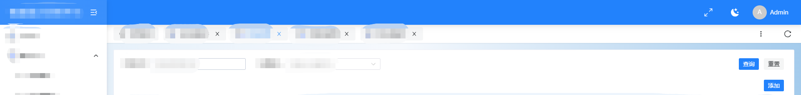
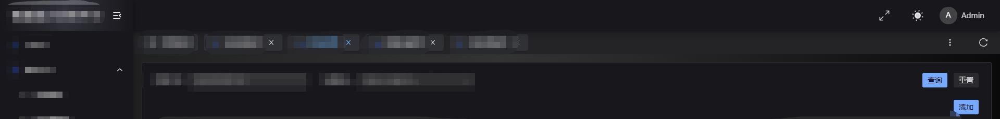
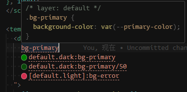
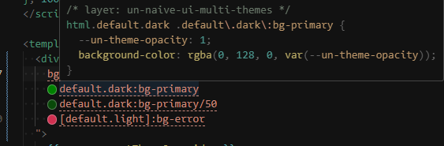
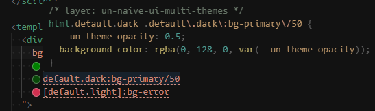
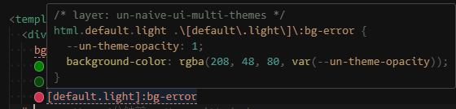
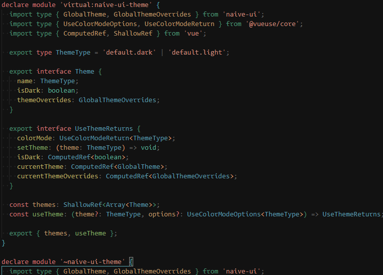
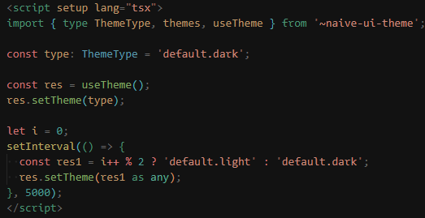

# @bluryar/naive-ui-themes

这是一个围绕 [naive-ui](https://github.com/tusen-ai/naive-ui) 开发的插件库, 面向后台管理系统开发过程中的多主题切换场景.

- 涉及的依赖库: Vite, UnoCss, VueUse, naive-ui

> 尽管支持多主题配置的实现很简单，但是建议您思考一个问题：在同一个应用代码中支持这样的写法会带来什么后果？
>
> 也许采用微前端的前端架构配合单一主题会更加合理。

<details>
  <summary>📃TODO</summary>

- [x] ~~useTheme 实现与参数调整~~
- [x] ~~naiveMultiTheme HMR 策略调整~~
- [x] ~~presetNaiveThemes preflight 的字符串大小减少~~
- [ ] SSR 支持
- [ ] HMR 改进 - 新增\重命名\删除主题文件时, 目前虚拟模块还未测试能否正常应用新的 mode
- [ ] 虚拟模块提供客户端导入模式

</details>

| 亮色                                    | 暗色                                    |
| --------------------------------------- | --------------------------------------- |
|  |  |

<details>
  <summary>效果</summary>

- **Unocss**

  
  _默认 - CSS Vars_

  
  _指定主题 - 固定颜色值_

  
  _指定主题 - 覆盖透明度_

  
  _指定主题 - 主题 variant 的另外种写法_

- **Vite Plugins**

  
  _虚拟模块类型定义生成_

  
  _虚拟模块使用_

</details>

## 使用

1. 安装

```bash
pnpm add @bluryar/naive-ui-themes
```

2. 配置

- unocss 预设

  _./unocss.config.ts_

  ```ts
  import { resolve } from 'node:path';
  import { defineConfig, presetUno } from 'unocss';
  import type { UserConfig } from 'unocss';
  import { type FileReaderOptions, presetNaiveThemes, tryRemoveThemeVariant } from '@bluryar/naive-ui-themes';

  const __dirname = fileURLToPath(new URL('.', import.meta.url));

  export const fileReaderOptions = {
    dir: resolve(__dirname, './src/themes'),
    patterns: ['*.(light|dark).(json|js|ts|cjs|mjs)'],
  } satisfies FileReaderOptions;

  const config = {
    presets: [
      tryRemoveThemeVariant(presetUno()),
      presetNaiveThemes({
        ...fileReaderOptions,
        autoimportThemes: !!1,
      }),
    ],
  } satisfies UserConfig;

  export default defineConfig(config);
  ```

- vite 的插件

  配置 UnoCSS 的 vite 插件时, 需要将 `configDeps` 配置为 `unocss.config.ts` 中的 `files` 属性, 以便 vite 在文件变更时重新编译.

  _vite.config.ts_

  ```ts
  import { defineConfig } from 'vite';
  import UnoVitePlugin from '@unocss/vite';
  import vue from '@vitejs/plugin-vue';
  import vueJsx from '@vitejs/plugin-vue-jsx';
  import { naiveMultiTheme, unsafeFileReaderSync } from '@bluryar/naive-ui-themes';
  import { NaiveUiResolver } from 'unplugin-vue-components/resolvers';
  import { fileReaderOptions } from './unocss.config';

  // https://vitejs.dev/config/
  export default defineConfig(() => {
    const { files } = unsafeFileReaderSync({ ...fileReaderOptions, parse: !!0 });

    return {
      optimizeDeps: {
        include: ['vue', 'vue-router', 'pinia', 'lodash', 'lodash-es'],
      },
      plugins: [
        vue(),
        vueJsx(),
        UnoVitePlugin({
          configDeps: [...files],
        }),
        naiveMultiTheme({
          dts: './src/types/auto-naive-theme.d.ts',
          ...fileReaderOptions,
        }),
      ],
    };
  });
  ```

3. 使用

   - 编写主题

     _src/default.dark.json_

     ```jsonc
     {
       "common": {
         "primaryColor": "#409eff"
         // ...
         // 这部分配置可以使用 naive-ui 的 文档提供的主题配置器来配置
       }
     }
     ```

   - 激活主题配置
     _src/App.vue_

     ```vue
     <template>
       <NConfigProvider :theme="currentTheme" :theme-overrides="currentThemeOverrides">
         <RouterView></RouterView>
       </NConfigProvider>
     </template>

     <script lang="ts" setup>
     import { useTheme } from '~naive-ui-themes';

     const { currentTheme, currentThemeOverrides } = useTheme();
     </script>
     ```

   - 切换主题

     _src/path/to/myVue.vue_

     ```vue
     <template>
       <div>
         <n-button>按钮</n-button>
       </div>
     </template>

     <script lang="ts" setup>
     import { useTheme } from '~naive-ui-themes';
     const {
       setTheme,
       isDark
     } = useTheme('default.light')

     watch(
       [isDark, otherCondition],
       () => {
         setTheme('default.dark')
       },
       {
         immediate: true
       }
     )
     ```

   - 使用主题变量

     下面给出常用的四种有效的主题选择器:

     _src/path/to/myVue.vue_

     ```vue
     <template>
       <div>
         <n-button :style="`background-color: --primary-color" class="bg-primary">按钮</n-button>
       </div>
     </template>

     <script lang="ts" setup></script>

     <style scoped>
     html[theme*='dark'] {
       background-color: var(--primary-color);

       @apply bg-primary;
     }
     </style>
     ```

## 背景

假如你的后台管理系统需要实现多主题切换, 那么选择 naive-ui 作为你的组件库是很好的, 基于 Vue 3 的 [依赖注入](https://cn.vuejs.org/guide/components/provide-inject.html) 和 [CSS Variable](https://developer.mozilla.org/zh-CN/docs/Web/CSS/Using_CSS_custom_properties) 可以很方便的实现多主题切换.

naive-ui 通过 [`<NConfigProvider>`](https://www.naiveui.com/zh-CN/os-theme/docs/customize-theme) 提供 `lightTheme` 和 `darkTheme` 作为主题的基础, 然后你可以通过配置 `themeOverrides` 来实现自定义主题.

但是, 当你尝试应用 [UnoCSS](https://unocss.dev/) 作为 CSS 样式方案时, 你会发现 UnoCSS 的 [PresetMini](https://unocss.dev/presets/mini#dark) 只提供了 `light` 和 `dark` 两种主题规则是生成预设, 而 VueUse 的 [useDark](https://vueuse.org/core/useDark/#usedark) 也只提供了 `dark` 和 `light` 两种主题切换的方法, 这就限制了使用场景.

<details>
  <summary><strong>🤔 为什么不使用 `Color-Schema` ?</strong></summary>

这里假设你使用 UnoCss 和 VueUse 的上述两个方案时, 选择的使用方式是给 `<body>` 或者 `<html>` 添加类名 `light` 或者 `dark`.
为什么不使用 [color-schema](https://developer.mozilla.org/zh-CN/docs/Web/CSS/color-scheme) 和 [@media prefer-color-scheme](https://developer.mozilla.org/zh-CN/docs/Web/CSS/@media/prefers-color-scheme)?

首先这两个属性的兼容型一般, 其次, color-schema 的可选值有限. 最后, 切换类名或者 html attribute 的方式可以很方便的实现多主题切换, 笔者暂未遇到没有非 color-schema 不可的场景.

简而言之, 切换 class 或者 HTML attributes 的方式, 使用简单, 兼容性好, **可控性强**.

</details>

## 解决方法

为了解决上述问题, 我们先要扩展 `UnoCSS` 的生成规则, 然后再扩展 `VueUse` 的 `useColorMode` 方法.

<details>
  <summary>UnoCSS 扩展变体</summary>

原有的 dark variant 源码:

```ts
import type { Variant } from '@unocss/core';
import type { PresetMiniOptions } from '..';
import { variantMatcher, variantParentMatcher } from '../utils';

export function variantColorsMediaOrClass(options: PresetMiniOptions = {}): Variant[] {
  if (options?.dark === 'class' || typeof options.dark === 'object') {
    const { dark = '.dark', light = '.light' } = typeof options.dark === 'string' ? {} : options.dark;

    return [
      variantMatcher('dark', (input) => ({ prefix: `${dark} $$ ${input.prefix}` })),
      variantMatcher('light', (input) => ({ prefix: `${light} $$ ${input.prefix}` })),
    ];
  }

  return [
    variantParentMatcher('dark', '@media (prefers-color-scheme: dark)'),
    variantParentMatcher('light', '@media (prefers-color-scheme: light)'),
  ];
}
```

我们只需要模仿一下成这样:

```ts
import type { Variant, PresetMiniOptions } from '@unocss/core';
import { variantMatcher } from '@unocss/core';

export function variantMultiColorsClass(options: PresetMiniOptions = {}): Variant[] {
  const { themes = ['light', 'dark'], selector = 'html', attribute = 'class', layer } = options;

  return themes.map((theme) => {
    const _selector = selector || '';
    const classNames = ['.', ...theme.split('.')].join(' ');
    const mergedSelector = attribute === 'class' ? `${_selector}${classNames}` : `${_selector}${attribute}=${theme}`;
    return variantMatcher(theme, (input) => ({ prefix: `${mergedSelector} $$ ${input.prefix}`, layer }));
  });
}
```

</details>

<details>
  <summary><strong>VueUse 改用 useColorMode</strong></summary>

> 是的, "改用", 这里假设你之前使用的是 `useDark` 这个方法.

_src/hooks/useThemes.ts_

```ts
import type { GlobalThemeOverrides } from 'naive-ui';
import { useColorMode } from '@vueuse/core';
import { lightTheme, darkTheme } from 'naive-ui';
import { themes } from '~naive-ui-themes'; // fake code

type ThemeType = 'light' | 'dark' | 'other';
type Theme = { name: ThemeType; isDark: boolean; themeOverrides: GlobalThemeOverrides };
// typeof themes extends Theme[]

// other 是你自定义的主题, 他的取值可以是 default.light, default.dark, 或者其他你自定义的主题
const modes = themes.map(({ name }) => ({ [name]: name.split('.').join(' ') }));

const useThemes = (initTheme = 'light') => {
  const colorMode = useColorMode({
    selector: 'html',
    attribute: 'class',
    initialValue: initTheme,
    modes,
    disableTransition: !!1, // 临时关闭切换主题时的所以transition, 需要过场动画需要另外实现
  });

  const setTheme = (theme: ThemeType) => {
    colorMode.value = theme;
  };

  const isDark = computed(() => modes[colorMode.value].isDark);
  const naiveTheme = computed(() => (isDark.value ? darkTheme : lightTheme));
  const naiveThemeOverrides = computed(() => modes[colorMode.value].themeOverrides);

  return {
    setTheme,
    isDark,
    naiveTheme,
    naiveThemeOverrides,
  };
};
```

之后, 你就可以在你的项目中使用 `useThemes` 这个 hook 来切换主题, 实现多主题切换了.

</details>

## 约定

在上面的代码中, 我们的配置下通过一个 [虚拟模块](https://cn.vitejs.dev/guide/api-plugin.html#virtual-modules-convention) 导入:

```ts
import { themes } from '~naive-ui-themes'; // fake code
```

这便是本插件期望完成的工作:

1. [x] 约定式主题配置
2. [x] 自动收集主题配置配置对象
3. [x] 提供主题配置文件的类型定义
4. [ ] 提供 VSCode 对于主题配置文件的智能提示

### 1. 约定式主题配置

为了集中管理主题配置, 我们约定主题配置文件的路径为 `src/themes/*.light.(json|js|ts)`, 这些 JSON 文件导出一个对象, 这个对象的定义符合 naive-ui 的[类型定义](<[Title](https://github.com/tusen-ai/naive-ui/blob/main/src/config-provider/src/internal-interface.ts#L101-L186C2)>):

<details>
<summary> NConfigProvider 的 theme-overrides 属性的类型定义 </summary>

```ts
export type GlobalThemeOverrides = {
  common?: Partial<ThemeCommonVars & CustomThemeCommonVars>;
} & {
  [key in keyof GlobalThemeWithoutCommon]?: ExtractThemeOverrides<GlobalThemeWithoutCommon[key]>;
};

export interface GlobalThemeWithoutCommon {
  Alert?: AlertTheme;
  Anchor?: AnchorTheme;
  AutoComplete?: AutoCompleteTheme;
  Avatar?: AvatarTheme;
  AvatarGroup?: AvatarGroupTheme;
  BackTop?: BackTopTheme;
  Badge?: BadgeTheme;
  Breadcrumb?: BreadcrumbTheme;
  Button?: ButtonTheme;
  ButtonGroup?: ButtonGroupTheme;
  Calendar?: CalendarTheme;
  Card?: CardTheme;
  Carousel?: CarouselTheme;
  Cascader?: CascaderTheme;
  Checkbox?: CheckboxTheme;
  Code?: CodeTheme;
  Collapse?: CollapseTheme;
  CollapseTransition?: CollapseTransitionTheme;
  ColorPicker?: ColorPickerTheme;
  DataTable?: DataTableTheme;
  DatePicker?: DatePickerTheme;
  Descriptions?: DescriptionsTheme;
  Dialog?: DialogTheme;
  Divider?: DividerTheme;
  Drawer?: DrawerTheme;
  Dropdown?: DropdownTheme;
  DynamicInput?: DynamicInputTheme;
  DynamicTags?: DynamicTagsTheme;
  Element?: ElementTheme;
  Ellipsis?: EllipsisTheme;
  Empty?: EmptyTheme;
  Equation?: EquationTheme;
  Form?: FormTheme;
  GradientText?: GradientTextTheme;
  Icon?: IconTheme;
  IconWrapper?: IconWrapperTheme;
  Image?: ImageTheme;
  Input?: InputTheme;
  InputNumber?: InputNumberTheme;
  Layout?: LayoutTheme;
  LegacyTransfer?: LegacyTransferTheme;
  List?: ListTheme;
  LoadingBar?: LoadingBarTheme;
  Log?: LogTheme;
  Menu?: MenuTheme;
  Mention?: MentionTheme;
  Message?: MessageTheme;
  Modal?: ModalTheme;
  Notification?: NotificationTheme;
  PageHeader?: PageHeaderTheme;
  Pagination?: PaginationTheme;
  Popconfirm?: PopconfirmTheme;
  Popover?: PopoverTheme;
  Popselect?: PopselectTheme;
  Progress?: ProgressTheme;
  Radio?: RadioTheme;
  Rate?: RateTheme;
  Result?: ResultTheme;
  Scrollbar?: ScrollbarTheme;
  Select?: SelectTheme;
  Skeleton?: SkeletonTheme;
  Slider?: SliderTheme;
  Space?: SpaceTheme;
  Spin?: SpinTheme;
  Statistic?: StatisticTheme;
  Steps?: StepsTheme;
  Switch?: SwitchTheme;
  Table?: TableTheme;
  Tabs?: TabsTheme;
  Tag?: TagTheme;
  Thing?: ThingTheme;
  TimePicker?: TimePickerTheme;
  Timeline?: TimelineTheme;
  Tooltip?: TooltipTheme;
  Transfer?: TransferTheme;
  Tree?: TreeTheme;
  TreeSelect?: TreeSelectTheme;
  Typography?: TypographyTheme;
  Upload?: UploadTheme;
  Watermark?: WatermarkTheme;
  Row?: RowTheme;
  // internal
  InternalSelectMenu?: InternalSelectMenuTheme;
  InternalSelection?: InternalSelectionTheme;
}
```

</details>

### 2. 自动收集主题配置配置对象

对于上面约定的配置对象存放目录, 我们开发了一个 unocss 的预设和一个 vite 的插件:

**unocss 预设 `presetNaiveThemes`**

- 将配置对象解码成 CSS 变量
  以样式表的形式挂载到指定元素上, 比如:

  ```css
  html.default.dark {
    --primary-color: #409eff;
    // ...
  }
  ```

- 收集配置对象的文件名

  作为 unocss 的 variants, 比如 `default.light.json`:

  ```html
  <div class="default.light:(bg-primary text-info)"></div>
  ```

- 扩展 unocss 的主题

  unocss 的主题遵循 [tailwind 的预设](<[Title](https://www.tailwindcss.cn/docs/theme)>) , 我们则将主题配置对象上的 `common`

  比如 `bg-primary` 使用的就是 `common.primaryColor` 的值

**vite 插件 `naiveMultiTheme`**

- 提供一个虚拟模块: `~naive-ui-themes` 或 `virtual:naive-ui-themes`

  模块提供了主题配置对象数组 `themes` 和 主题切换 hook `useTheme`

  <details>
  <summary> 虚拟模块的类型定义 </summary>

  ```ts
  declare module '~naive-ui-theme' {
    import type { GlobalTheme, GlobalThemeOverrides } from 'naive-ui';
    import type { UseColorModeReturn } from '@vueuse/core';
    import type { ComputedRef } from 'vue';

    export type ThemeType = 'default.dark' | 'default.light';

    export interface Theme {
      name: ThemeType;
      isDark: boolean;
      themeOverrides: GlobalThemeOverrides;
    }

    export interface UseThemeReturns {
      colorMode: UseColorModeReturn<ThemeType>;
      setTheme: (theme: ThemeType) => void;
      isDark: ComputedRef<boolean>;
      currentTheme: ComputedRef<GlobalTheme>;
      currentThemeOverrides: ComputedRef<GlobalThemeOverrides>;
    }

    declare const themes: Array<Theme>;
    declare const useTheme: (theme: ThemeType) => UseThemeReturns;

    export { themes, useTheme };
  }
  ```

  </details>

- 提供 HMR

  当主题配置文件发生变化时, 会自动更新虚拟模块

### 3. 提供主题配置文件的类型定义

在 vite 插件工作时, 我们会对比插件, 然后生成一份主题配置文件的类型定义

### 4. 提供 VSCode 对于主题配置文件的智能提示

暂未实现, 因为收益不大, 但是如果你的项目使用的是 JSON 来管理配置文件, 那么, 你可以利用 `typescript-json-schema` 这个库将类型定义转换成 JSON Schema, 然后配置到 `settings.json` 中, 从而获得智能提示

_setting.json_

```json
{
  "json.schemas": [
    {
      "fileMatch": ["path/to/your/naive-ui-themes/*.json"],
      "url": "path/to/naive-ui-themes.schema.json"
    }
  ]
}
```
